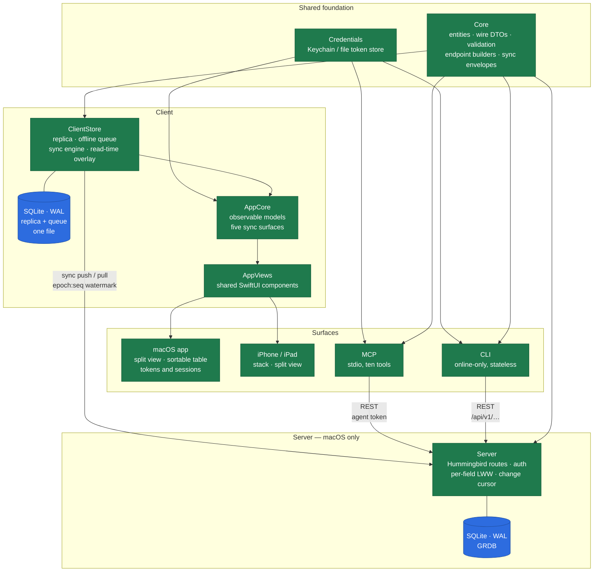

# Issues

A lightweight, self-hosted, offline-first issue tracker in Swift. One shared
domain model, five surfaces over it: an HTTP server, a CLI, macOS and
iPhone/iPad apps, and an MCP interface for agents. All five are built.

Self-hosted means one small team on one Mac — not a platform. Offline-first means
the apps hold a full replica and a queue of unsent writes, and keep working on a
plane.

## Architecture



**Two contracts, one concurrency model.** A REST resource API for the CLI, MCP
and scripts; a narrow sync pair (`sync/push`, `sync/pull`) for the offline-first
apps. Both are generated from the same Core DTOs — that shared origin is the only
thing stopping them drifting apart.

**Per-field last-write-wins, arbitrated by the server's receipt timestamp**, never
by a client clock. Deletion is terminal and beats a concurrent edit. Nothing is
hard-deleted; tombstones are kept indefinitely, because a client that forgot one
would resurrect the record on its next pull.

**The client stores only what the server confirmed.** What you see is that base
record with your unsent operations applied on read, which is also what makes
"which fields are locally dirty" answerable without a second copy that could
disagree.

## Building

Requires **Swift 6.3** and **macOS 26** on Apple silicon.

```sh
make build      # build everything
make test       # 1,275 tests, ~4 seconds
make coverage   # tests plus the per-target coverage gates
make lint       # swift format, strict
make build-ios  # the shared app layer, compiled for iOS
make pkg        # the per-user installer package
```

The macOS app is a separate Xcode project:

```sh
xcodebuild -project Apps/Issues.xcodeproj -scheme Issues build
```

## Running a server

```sh
export ISSUES_BOOTSTRAP_ADMIN_EMAIL=you@example.com
export ISSUES_BOOTSTRAP_ADMIN_PASSWORD='a long passphrase'
swift run issues-server
```

Everything lives under the user's own `~/Library/Application Support/Issues` —
the install is rootless and runs under a LaunchAgent, not a LaunchDaemon. Without
the environment variables, first run mints a single-use setup token instead.

### Installing it

```sh
make pkg    # build/Issues-<version>.pkg
```

A **per-user package**: no administrator password, nothing owned by root. It puts
`issues-server`, `issues` and `issues-mcp` in `~/.local/bin`, loads a LaunchAgent
that starts the server at login, and sends its output — including the one-time
setup token — to `~/Library/Logs/Issues/server.log`. Re-running it is the upgrade
path: the agent is stopped, the binaries replaced, the agent reloaded.

It is unsigned unless `PKG_SIGN_IDENTITY` names a Developer ID Installer
certificate, so on another Mac install it with `installer -pkg Issues-<version>.pkg
-target CurrentUserHomeDirectory` or right-click, Open.

`issues-server uninstall` reverses it and leaves your data alone. To set the agent
up by hand — after `swift build -c release`, say — `issues-server install-agent`
does the same job the package's postinstall does, and is safe to re-run.

### Operating it

```sh
issues-server backup ~/backups/issues-2026-09-14.sqlite   # safe while serving
issues-server inspect ~/backups/issues-2026-09-14.sqlite  # what is in it
issues-server restore ~/backups/issues-2026-09-14.sqlite --force
issues-server admin reset-password you@example.com        # the way back in
issues-server config validate
```

**Back up with `backup`, never with `cp`.** A live database is three files and
keeps recent commits in the `-wal`, so a copied `issues.sqlite` can be stale or
corrupt — and looks fine until the day you need it. `backup` uses SQLite's online
backup to write one consistent file without stopping the server.

**A restore mints a new instance epoch**, so every client full-resyncs on its next
pull rather than believing a rewound change sequence is current. Queued offline
changes survive it. The database being replaced is moved aside, not deleted, and
`restore` refuses outright while the server is running.

An automatic copy is taken immediately before any schema migration, which is the
only thing on startup that could otherwise destroy data with no way back.

## Using the CLI

```sh
issues config set url https://issues.example.com
issues auth login
issues create -t "Sync queue stalls behind a quarantined op" --priority urgent
issues list --status todo,inProgress --assignee me
issues show PROJ-142 --json
```

`issue` is the implied noun, so `issues list` means `issues issue list`. Exit codes
are a published contract: `0` success, `1` failure, `2` usage, `3` not found,
`4` auth, `5` conflict, `6` gone — `3` and `6` differ because "it was deleted" is a
different branch from "no such thing".

## Testing

Test-driven throughout, with per-target coverage floors and a **no-regression
baseline** that does more real work than any absolute number.

| Target | Coverage | Floor |
| --- | --- | --- |
| Core | 99.47% | 90% |
| ClientStore | 99.59% | 85% |
| Server | 97.72% | 80% |
| AppCore | 97.68% | 80% |
| CLI | 95.28% | 70% |
| MCP | 90.27% | 70% |
| Credentials | 45.87% | 40% |

`Credentials` is low on purpose: the file store is fully tested, but the Keychain
implementation beside it only runs with `ISSUES_TEST_KEYCHAIN` set, because a
locked login keychain on a hosted runner can prompt and then hang the job.

SwiftUI view bodies are deliberately ungated — anything that can be *wrong* lives
in `AppCore` where it is tested, leaving the views with nothing to decide.
`swift run issues-preview` renders every component with every sync state, for the
parts a test cannot check.

The CLI and client suites run **in-process against the real router** rather than
against fixtures, so a contract mistake fails there instead of surfacing months
later in a view.

## Design record

`docs/adr/` holds ten ADRs; `CONTEXT.md` is the domain glossary. The working map,
including decisions taken during implementation and the traps worth knowing, is
`.scratch/v1-architecture/map.md`.
